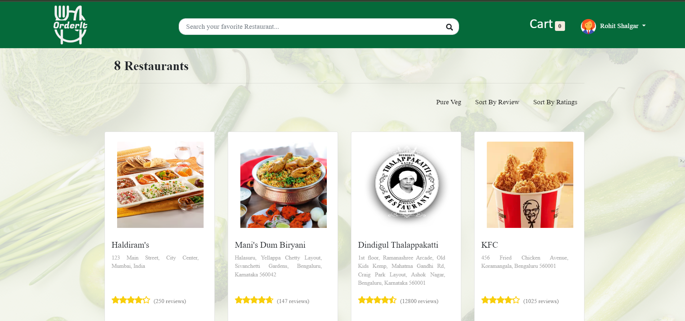
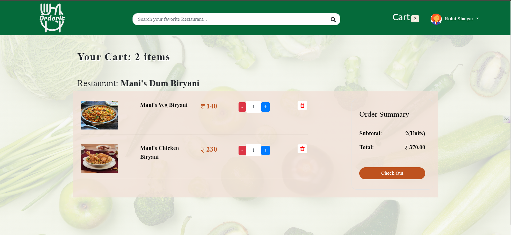
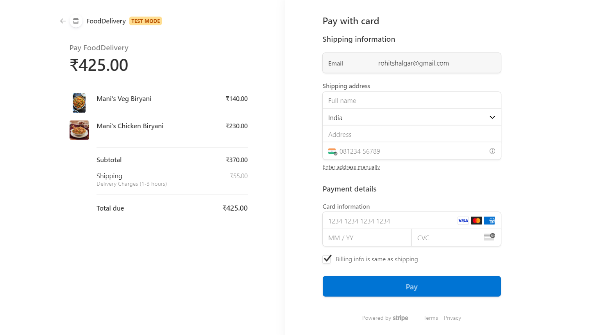

# 🍔 Food Delivery Website

An advanced **Food Delivery Website** built using the **MERN** stack. This project delivers a seamless food ordering experience and incorporates essential features like **Cloudinary** for image storage, **Stripe** for secure payments, and **Mailtrap** for email functionality.

## 🚀 Features

- **🛒 User-friendly** food ordering system with smooth navigation.
- **🌐 Cloudinary** integration for secure and fast **image storage**.
- **💳 Stripe** for safe and secure **payment processing**.
- **📧 Mailtrap** for reliable and efficient **email delivery** services.
- **📱 Responsive Design** across mobile, tablet, and desktop platforms.
- **🔗 Backend** powered by Node.js and Express for scalable performance.

## 🛠️ Technologies Used

- **Frontend**: React.js for a dynamic and responsive user interface.
- **Backend**: Node.js and Express for a fast and secure server.
- **Database**: MongoDB for flexible and scalable data management.
- **Cloudinary**: For optimized image storage.
- **Stripe**: Secure payment gateway integration.
- **Mailtrap**: For email functionality during development.

---

## 📸 Screenshots

### 🏠 Home Page


### 🍽️ Food Selection Page


### ✅ Order Confirmation


### 💳 Payment Gateway



---

## 🛠️ Installation Instructions

To set up the project locally, follow these steps:

1. **Clone the repository**:
    ```bash
    git clone https://github.com/RohitShalgar4/FoodOrder-MERN.git
    ```

2. **Install Frontend Dependencies**:
    ```bash
    cd frontend
    npm install --force
    ```

3. **Install Backend Dependencies**:
    ```bash
    cd backend
    npm install --force
    ```

4. **Run the Application first on Backend then Frontend**:
    ```bash
    npm start
    ```

---

## ⚙️ How It Works

- **🌐 Cloudinary**: Stores all images securely, ensuring fast delivery and optimized file sizes.
- **💳 Stripe**: Processes payments with industry-leading security protocols.
- **📧 Mailtrap**: Handles email delivery during development, ensuring all transactional and notification emails are tested safely.

---

## 🤝 Contributions

We welcome contributions from the community! If you have suggestions or improvements, please fork the repository and submit a pull request.


